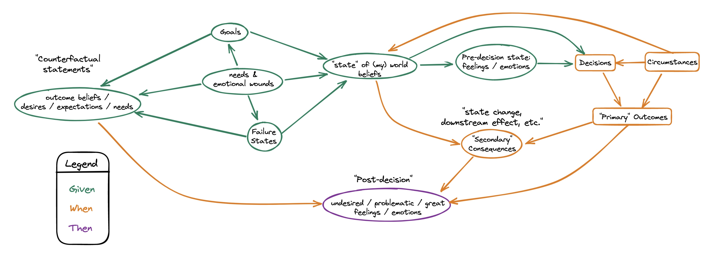
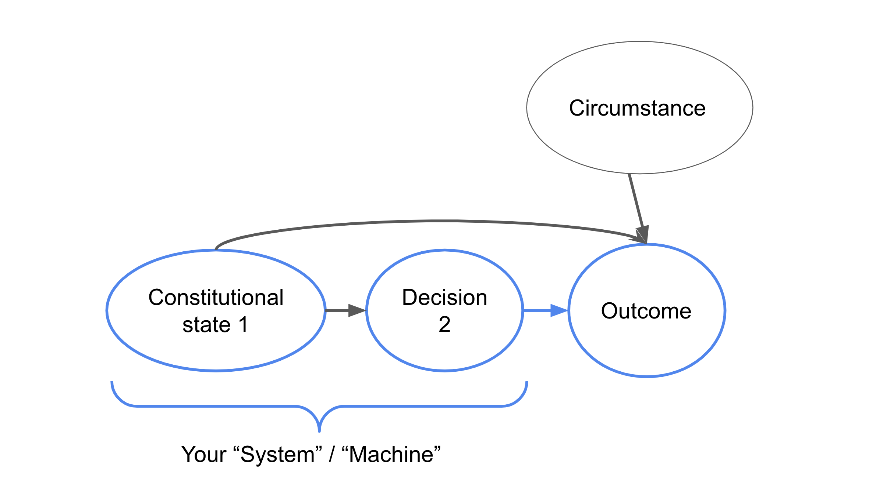

# An introspection graph

## Context

Dear Young Tim,

This post follows the recent stream of psychology focused dispatches.
The context is the familiar one:
we face problems in life where there are
discrepancies between feelings we have and feelings we want
and between outcomes we have and outcomes we want.
In order to achieve the feelings and outcomes we desire,
it is helpful to understand how we came to our undesired states in the first
place. Moreover, I believe we increase our probability of successfully achieving
our goals by systematically investigating the factors currently causing our
issues.

In particular, I think it's helpful to have a set of questions to start from
when trying to understand our personal problems.
Of course, having a collection of questions is only the first step.
Humans have great [difficulty](https://en.wikipedia.org/wiki/The_Magical_Number_Seven,_Plus_or_Minus_Two)
holding numerous items in our mind at once,
so we're going to want to chunk these questions to facilitate understanding.
Here, I think it is most natural to organize the questions around the
process that leads to our undesired state.

The graph below shows our current conceptualization of this process, in general.

It attempts to explicitly delineate a 'complete' set of causal factors that
lead to outcomes and feelings that we do not want.
Beyond serving as a tool to convey our current understanding,
this graph is meant to be used as a map to guide our process of introspection.

## Relation to previous posts

The introspection graph above extends the causal graph for debugging problems
that I drew in
[February](https://timothyb0912.github.io/blog/reading/2021/02/28/Causally-Engineering-Life.html):

Specifically, the current introspection graph expands the focus of our
problem-solving from 'objective' outcomes to include our subjective,
post-decision feelings.
The current graph also expands the 'constitutional state' or 'root cause' node
to expose the interconnected set of variables that affect our decisions and
post-decision feelings:
- beliefs
- goals
- failure-states
- needs
- emotional-wounds
- pre-decision feelings

With this greater specificity,
we gain increased insight as to where we can intervene to resolve our problems.

Additionally, today's post relates to May's post on
[psychological-optimization](https://timothyb0912.github.io/blog/psychology/2021/05/30/Psychological-optimization.html).
Specifically, the psychological optimization process,
as I conceive of it so far, involves three steps:
education, introspection, and integration.
Today's post overviews what I mean by introspection.

## Introspection elements

To begin, I'll explain why the introspection graph has its given structure.
In particular, there are numerous sources that have shaped my understanding of
how we come to have the feelings and outcomes that we experience.

First, there are the ideas of
[Nonviolent Communication](https://en.wikipedia.org/wiki/Nonviolent_Communication).
Here, the basic premise is that many conflicts arise because of unspecified
feelings and needs.
Though Nonviolent Communication focuses on interpersonal conflicts,
I've already [described](https://timothyb0912.github.io/blog/psychology/2021/08/16/Effective-thinking-is-effective-communication.html)
how thinking is internal communication between parts of oneself.
Accordingly, the focus on feelings and needs for the resolution of conflicts
appears likely to be useful for resolving internal conflicts as well.
This motivates the expansion of the causal debugging graph to explicitly denote
one's feelings post-decision and post-outcome.

Second, the role of emotions in driving our decisions is
[well-known](https://www.psychologytoday.com/us/blog/intense-emotions-and-strong-feelings/201012/it-or-not-emotions-will-drive-the-decisions-you)
and mercilessly exploited in business applications such as marketing.
As a result, our pre-decision feelings and emotions are explicitly noted on
the introspection graph.

Third, following the learnings of
"[rational emotive behavior therapy](https://en.wikipedia.org/wiki/Rational_emotive_behavior_therapy)" and
"[cognitive behavioral therapy](https://en.wikipedia.org/wiki/Cognitive_behavioral_therapy),"
we note that our beliefs cause our feelings.
Here, we draw a distinction between our beliefs about our pre-decision state,
leading to our feelings before we make some decision,
and our counterfactual beliefs about the meaning or significance of
potential outcomes.
These counterfactual beliefs cause our post-decision feelings,
in combination with the actual outcome of the decision and
any new, 'objective' state we transition into because of our decion's outcome.
Accordingly, we include nodes for both our beliefs about our original state and
our counterfactual beliefs, and we include nodes to denote the direct outcome
of our decision as well as any secondary consequences of those outcomes.
I'll give an example in a moment to clarify this.

<!-- describe goal and failure-state nodes -->
Fourth, we have two complementary nodes of goals and failure-states.
From [choice modelling research](https://www.sciencedirect.com/science/article/abs/pii/S002224961300028X)
at one interface of psychology and discrete choice,
i.e. within the realm of mathematical psychology,
we are reminded that humans (that means us!)
make decisions in pursuit of goals they wish to achieve.
Further, [positive psychology research](https://psycnet.apa.org/record/2003-04013-006)
reminds us that people have not only
goals they wish to actively obtain / experience
but also undesired or unfavorable failure-states they hope to avoid.
These two types of guideposts directly influence what we believe about the world
and what we believe about the impact of potential outcomes,
hence their placement in the introspection graph.

<!-- describe needs and emotional wounds nodes -->
Finally, we have our underlying needs and emotional wounds.
All humans have physical and emotional needs that we attempt to meet.
For a non-exhaustive list of such needs (as examples),
see [here](https://www.cnvc.org/training/resource/needs-inventory) or
[here](http://sfhelp.org/relate/keys/needs.htm).
Our goals and failure states are often directly aimed at meeting such needs.
Moreover, the degree to which our needs are met greatly impact our beliefs about
our world.

Likewise, the emotional wounds that we have suffered affect what goals we
attempt to achieve and what failure-states we attempt to avoid,
all to prevent further hurt.
Our wounds also act as a filter through which we interpret the events of life
when forming our beliefs.
For a non-exhaustive list of such emotional wounds,
see [here](https://web.archive.org/web/20210816011433/https://selftherapyjourney.com/Pattern/Beginning/List_of_Wounds.aspx)
and [here](http://sfhelp.org/gwc/wounds.htm).
